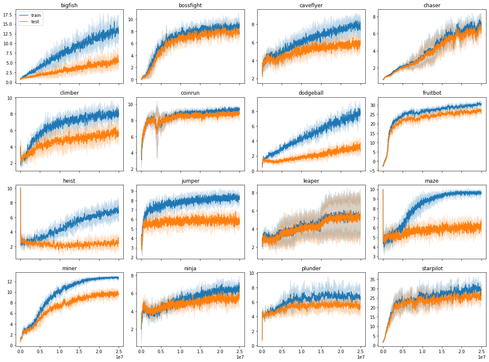

# train-procgen-pfrl

[Procgen](https://openai.com/blog/procgen-benchmark/) is a suite of
16 procedurally-generated environments that serves as a benchmark to measure how
quickly a reinforcement learning agent learns generalizable skills.
OpenAI provided [train-procgen](https://github.com/openai/train-procgen) as
sample code to train agents in these environments.
Their code is based on [baselines](https://github.com/openai/baselines) and
Tensorflow 1.15 (at the time of writing).

This repo is the PyTorch version of train-procgen that uses the
[pfrl](https://github.com/pfnet/pfrl) library from
[Preferred Networks](https://preferred.jp/en/).
We train and evaluate all the 16 tasks and have reproduced the results
(we use all configurations under the easy level test protocol).
On a single V100 GPU, it takes about 3 hours to reproduce our results in one task.



## Reproduce the Results

Run the following command to train a PPO agent in the `coinrun` environment.
By default, models and logs are saved in the `./log` folder.
```shell
python train_procgen.py --env-name=coinrun \
    --num-levels=200 \
    --start-level=100 \
    --distribution-mode=easy \
    --exp-name=trial01
```

## Disclaimer
This is not an official Google product.
